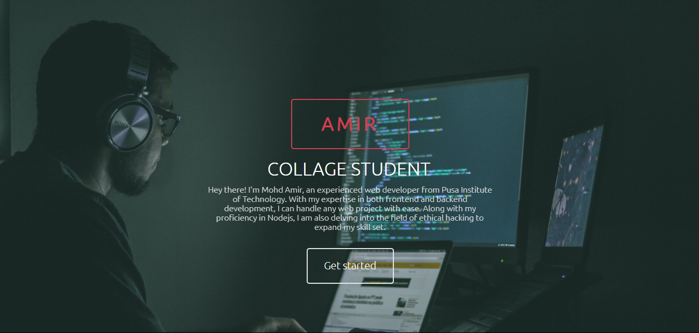
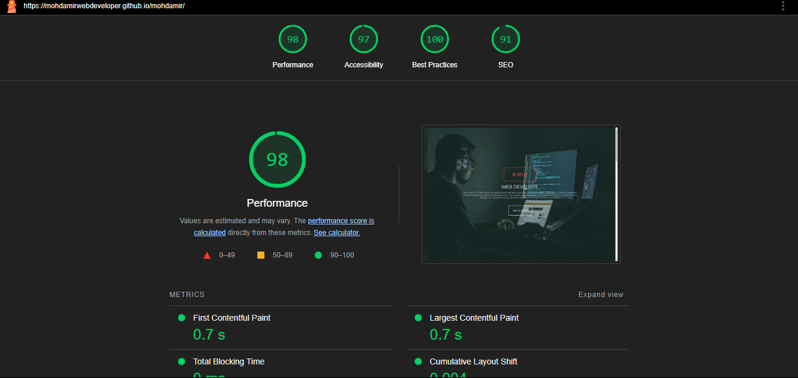

# Mohd Amir - Portfolio

Welcome to my personal portfolio! This is where I showcase my projects, skills, and experiences. Feel free to explore and get in touch if you have any inquiries or opportunities.

## 🚀 Demo

## 🌟 Google Lighthouse Score

My portfolio is optimized for performance, accessibility, best practices, and SEO. Here are the scores from Google Lighthouse:

- **Performance**: 98
- **Accessibility**: 97
- **Best Practices**: 100
- **SEO**: 91

## 🛠️ Technologies Used

- **Frontend**: HTML, CSS, JavaScript, React
- **Styling**: Tailwind CSS, NativeWind
- **Backend**: Node.js, Express
- **Hosting**: Netlify

## 📫 Contact

- **Email**: mohdamir2571@gmail.com
- **LinkedIn**: [linkedin.com/in/amirdevelops](https://www.linkedin.com/in/amirdevelops)

Thank you for visiting my portfolio! I hope you find it insightful and engaging.
